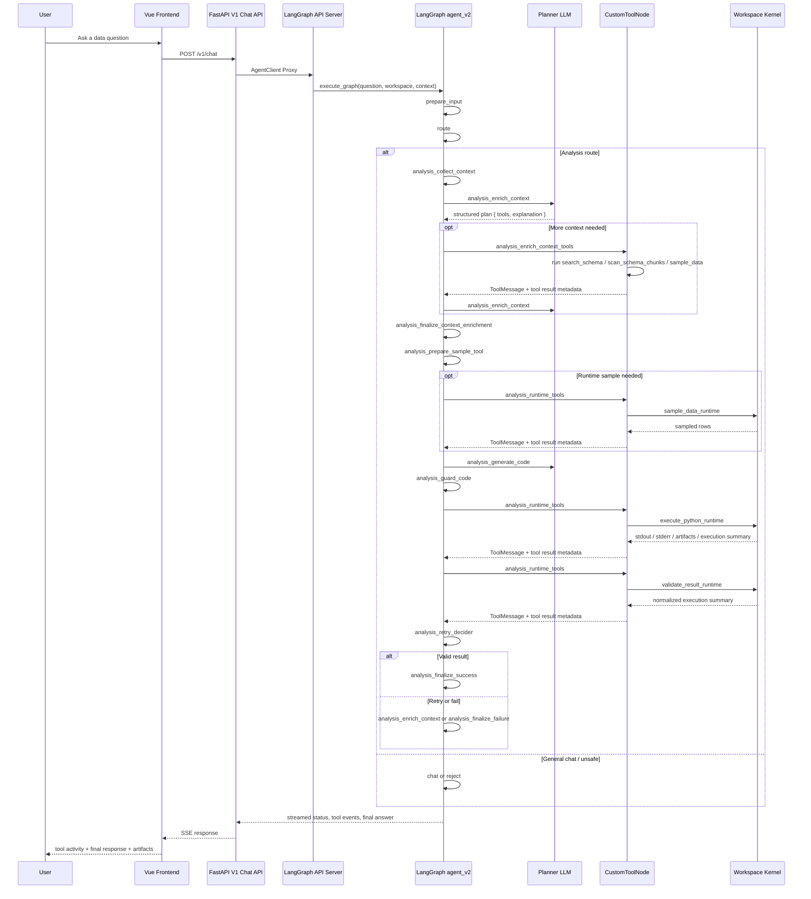
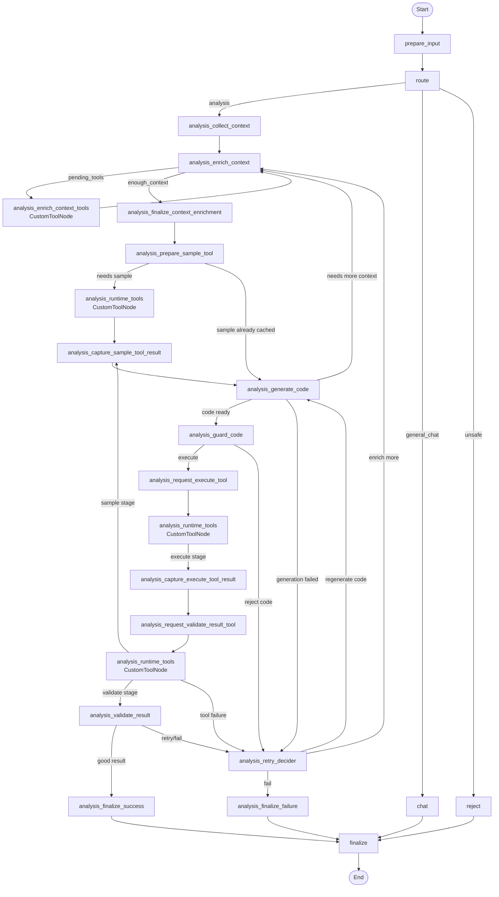
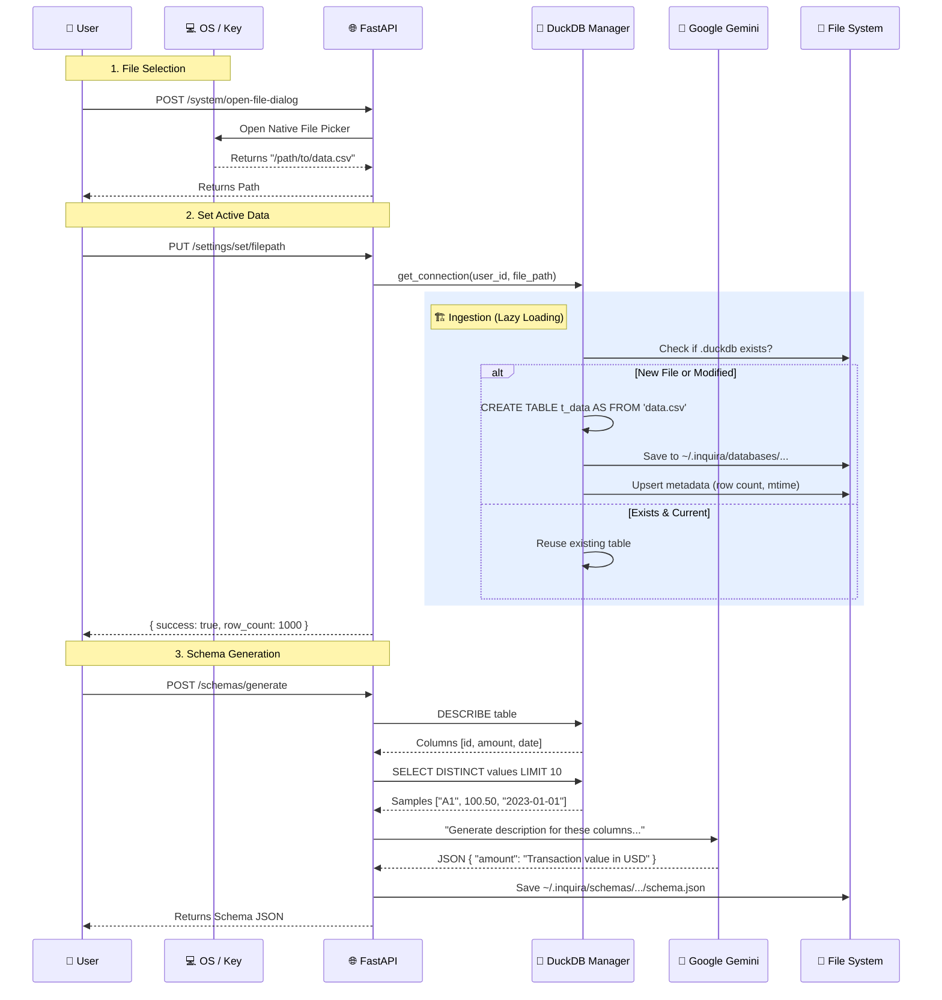
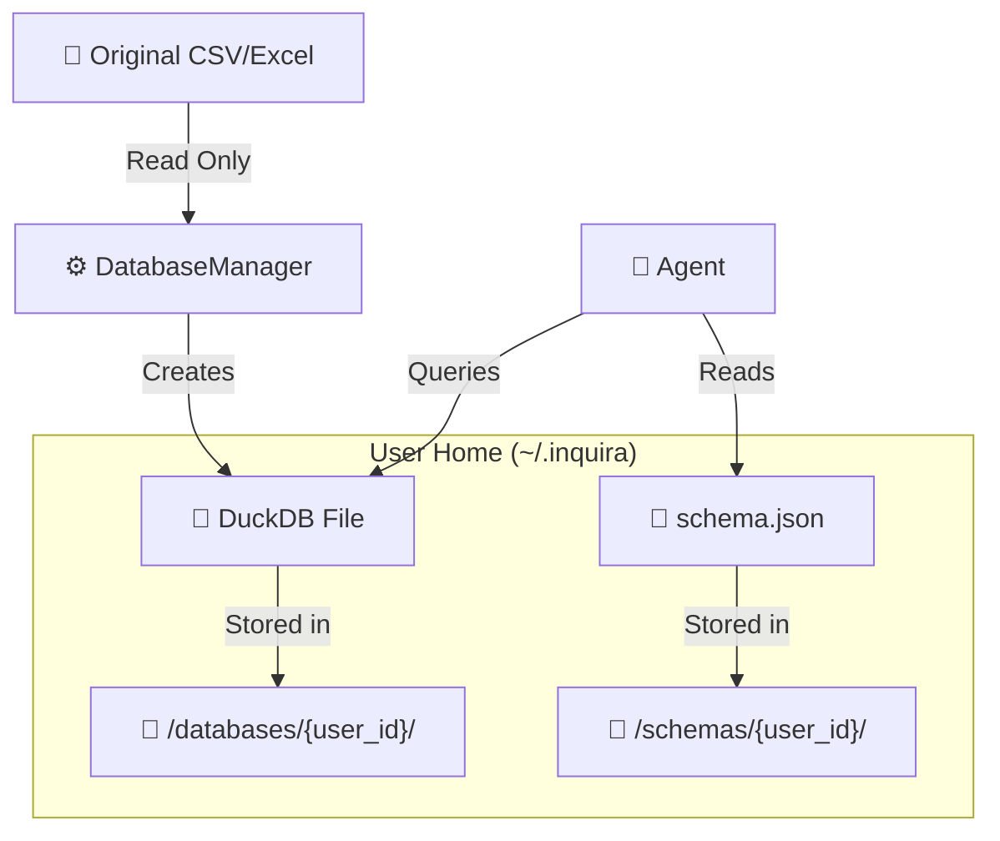

# System Architecture

Inquira CE operates as a robust local-first desktop application. To guarantee data privacy and execution stability, the architecture is decoupled into four distinct layers:

## 1. Presentation Layer (Tauri + Vue)
The user interface is a Vue.js single-page application wrapped in a lightweight **Tauri** desktop shell (written in Rust). 
- **Purpose**: Provides native OS integrations (like file pickers) and renders the interactive workspace (streaming chat, AG Grid tables, Plotly charts).
- **Control**: The UI communicates strictly with the local backend API and never touches the database layers directly.

## 2. Orchestration Layer (FastAPI)
The central nervous system of Inquira is a local **FastAPI** server that starts automatically when the desktop app launches.
- **Purpose**: Manages REST API endpoints, handles server-sent events (SSE) for streaming chat tokens, and tracks the lifecycle of local Jupyter kernels.
- **Workspace Isolation**: Ensures each analysis session has its own dedicated directory on disk, completely isolating persistence layers across projects.

## 3. Data Engine (DuckDB)
Instead of relying on fragile in-memory dataframes that crash the app when sized incorrectly, Inquira translates raw files (CSV, Excel, JSON, Parquet) into robust local relational databases.
- **Purpose**: Uses **DuckDB** for lightning-fast analytics queries capable of scanning out-of-memory datasets natively.
- **Persistence**: File ingestions and schema generations are saved to disk instantly, allowing users to close the app and perfectly resume their session states later without re-importing data.

## 4. Agent Execution Layer (LangGraph API + Jupyter)
Inquira strictly separates the "Thinking" (the Planner Agent) from the "Doing" (the Code Runner) for maximum reliability.
- **Standalone Agent Service**: Built on **LangGraph** (`agent_v2`), the agent runs entirely decoupled from the core FastAPI backend as a standalone API service. This highly modular design means the Frontend communicates with the Backend, which then streams negotiated executions with the distinct Langgraph Agent process over the local network via `AgentClient`.
- **Jupyter Kernel**: Generated Python code is executed in an actively monitored, isolated Jupyter runtime managed by the Backend orchestrator—**not** locally inside the LangGraph agent process. This guarantees that if user-generated code crashes or memory-limits are hit, the orchestrating agent survives to report the failure.

---

## Deep Dives
Understand the specific execution sequences by exploring the diagrams below.
*(Prefer side-by-side studying? Open the standalone [Agent Workflow](./workflow_diagram.md) or [Data Pipeline](./data_pipeline_diagram.md) pages).*

---

### Inquira Workflow Diagram

This sequence shows the current end-to-end request flow from the desktop UI to the backend workspace kernel and the `agent_v2` LangGraph graph.

#### End-to-End Request Flow

#### Current LangGraph Node Flow

---

### Data Processing Workflow

This explicitly explains how raw CSV/Excel files are transformed into queryable data within Inquira.

#### Data Ingestion Pipeline

#### Storage Architecture

