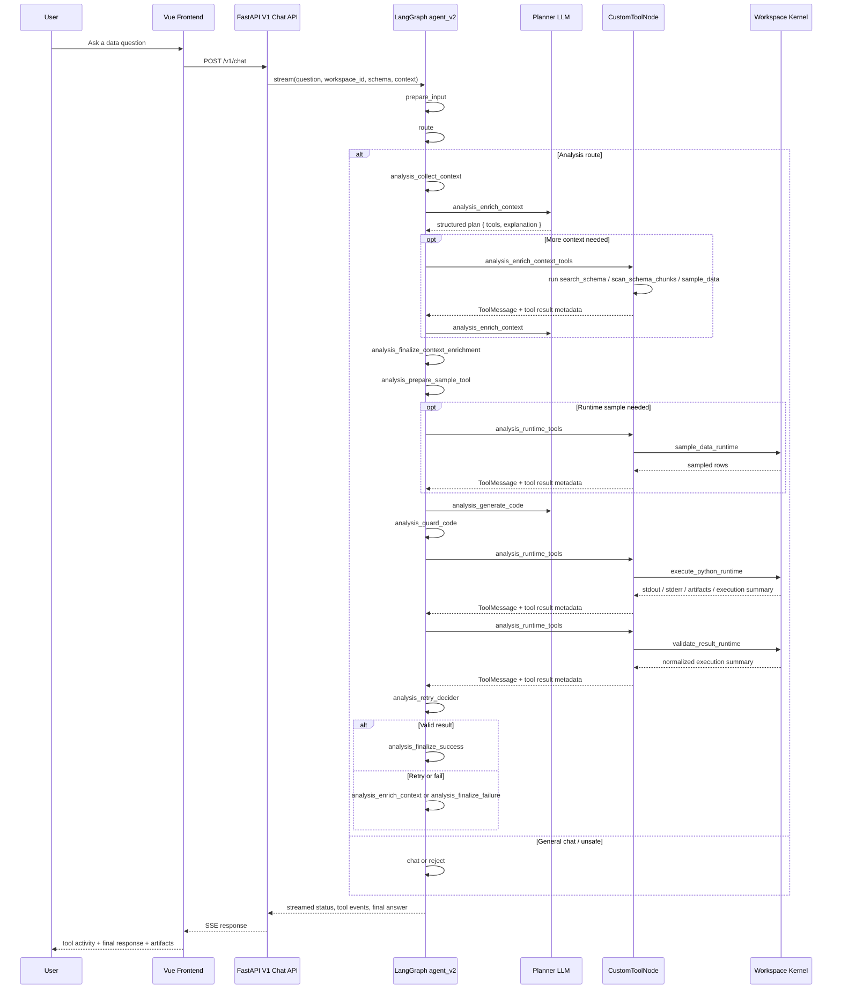
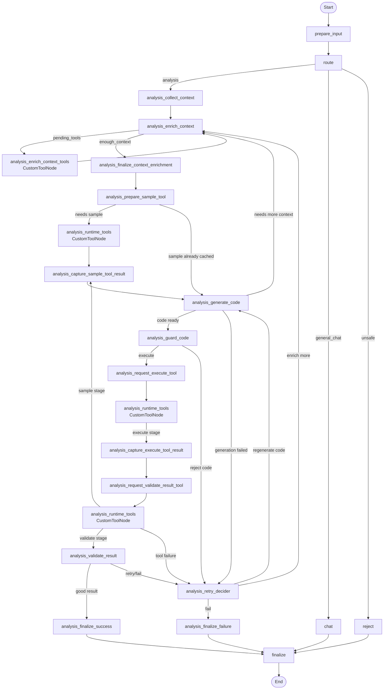

# Inquira Workflow Diagram

This document shows the current end-to-end request flow from the desktop UI to the backend workspace kernel and the `agent_v2` LangGraph graph.

## End-to-End Request Flow

## Current LangGraph Node Flow

## Notes

- The planner no longer relies on raw `model.bind_tools(...)` output for the main analysis loop. It emits structured tool plans with a short operational explanation.
- `CustomToolNode` is the canonical executor for graph-managed tools. It emits `ToolMessage` objects into graph state and also emits tool call/result events for the UI and tracing backends.
- Generated Python runs through the backend workspace kernel, not inside the agent process. That keeps package availability and artifact generation aligned with the active workspace.
- Code generation now instructs the model to use meaningful figure variable names such as `strike_rate_by_batter_fig` instead of generic names like `fig`.
