# Data Processing Workflow

This document explains how raw CSV/Excel files are transformed into queryable data within Inquira.

## Data Ingestion Pipeline

```mermaid
sequenceDiagram
    participant User as 👤 User
    participant System as 💻 OS / Key
    participant API as 🌐 FastAPI
    participant DuckDB as 🦆 DuckDB Manager
    participant LLM as 🧠 Google Gemini
    participant Storage as 💾 File System

    Note over User, System: 1. File Selection
    User->>API: POST /system/open-file-dialog
    API->>System: Open Native File Picker
    System-->>API: Returns "/path/to/data.csv"
    API-->>User: Returns Path

    Note over User, API: 2. Set Active Data
    User->>API: PUT /settings/set/filepath
    API->>DuckDB: get_connection(user_id, file_path)
    
    rect rgb(230, 240, 255)
        Note left of DuckDB: 🏗️ Ingestion (Lazy Loading)
        DuckDB->>Storage: Check if .duckdb exists?
        
        alt New File or Modified
            DuckDB->>DuckDB: CREATE TABLE t_data AS FROM 'data.csv'
            DuckDB->>Storage: Save to ~/.inquira/databases/...
            DuckDB->>Storage: Upsert metadata (row count, mtime)
        else Exists & Current
            DuckDB->>DuckDB: Reuse existing table
        end
    end
    
    API-->>User: { success: true, row_count: 1000 }

    Note over User, API: 3. Schema Generation
    User->>API: POST /schemas/generate
    
    API->>DuckDB: DESCRIBE table;
    DuckDB-->>API: Columns [id, amount, date]
    API->>DuckDB: SELECT DISTINCT values LIMIT 10
    DuckDB-->>API: Samples ["A1", 100.50, "2023-01-01"]
    
    API->>LLM: "Generate description for these columns..."
    LLM-->>API: JSON { "amount": "Transaction value in USD" }
    
    API->>Storage: Save ~/.inquira/schemas/.../schema.json
    API-->>User: Returns Schema JSON
```

## Storage Architecture

Where does your data actually go?

```mermaid
graph TD
    Source["📄 Original CSV/Excel"] -->|Read Only| Ingestion["⚙️ DatabaseManager"]
    Ingestion -->|Creates| DB["🦆 DuckDB File"]
    
    subgraph HomeDir ["User Home (~/.inquira)"]
        DB -->|Stored in| DBDir["📂 /databases/{user_id}/"]
        Schema["📜 schema.json"] -->|Stored in| SchemaDir["📂 /schemas/{user_id}/"]
    end
    
    Agent["🤖 Agent"] -->|Queries| DB
    Agent -->|Reads| Schema
```

