# Inquira Workflow Diagram

This document illustrates how a user request flows through the system, from the Vue.js frontend to the FastAPI backend and into the LangGraph agent.

## End-to-End Request Flow

```mermaid
sequenceDiagram
    participant User as 👤 User
    participant Frontend as 🖥️ Vue Frontend
    participant API as 🌐 FastAPI (/chat)
    participant Agent as 🤖 LangGraph Agent
    participant LLM as 🧠 Google Gemini

    User->>Frontend: Enters Question ("Analyze sales data")
    Frontend->>API: POST /chat (question, context, table_name)
    
    Note over API: 1. Verify API Key<br/>2. Load User Settings<br/>3. Load Schema JSON

    API->>Agent: ainvoke(InputState)
    
    rect rgb(240, 248, 255)
        Note left of Agent: 🛡️ Safety Check
        Agent->>LLM: Is this question safe? (is_safe_prompt)
        LLM-->>Agent: { is_safe: true }
        
        Note left of Agent: 🎯 Relevancy Check
        Agent->>LLM: Is this relevant to the schema? (is_relevant_prompt)
        LLM-->>Agent: { is_relevant: true }
        
        Note left of Agent: ⚡ Code Requirement
        Agent->>LLM: Does this need Python code? (require_code_prompt)
        LLM-->>Agent: { require_code: true }
        
        alt Needs Code (Analysis)
            Agent->>LLM: Create high-level plan (create_plan_prompt)
            LLM-->>Agent: { plan: "1. Load data..." }
            
            Agent->>LLM: Generate Python code (codegen_prompt)
            LLM-->>Agent: { code: "import pandas..." }
        else No Code (General Chat)
            Agent->>LLM: Generate text response (noncode_prompt)
            LLM-->>Agent: { message: "Hello!" }
        end
    end

    Agent-->>API: Result State (messages, code, metadata)
    
    Note over API: Construct DataAnalysisResponse<br/>(code, explanation, validation)

    API-->>Frontend: JSON { code: "...", explanation: "..." }
    Frontend-->>User: Displays Code & Explanations
```

## LangGraph Internal Logic

The Agent decides its path dynamically based on the metadata it gathers at each step.

```mermaid
flowchart TD
    Start([Start]) --> Safety[❓ Check Safety]
    Safety -->|Safe| Relevancy[❓ Check Relevancy]
    Safety -->|Unsafe| Reject[🛑 Unsafe Rejector]
    
    Relevancy -->|Relevant| NeedCode[❓ Require Code?]
    Relevancy -->|Irrelevant| General[🗣️ General Purpose Chat]
    
    NeedCode -->|Yes| Plan[📝 Create Plan]
    NeedCode -->|No| NonCode[💬 Non-Code Generator]
    
    Plan --> GenCode[⚙️ Code Generator]
    
    GenCode --> End([End])
    NonCode --> End
    General --> End
    Reject --> End
```

